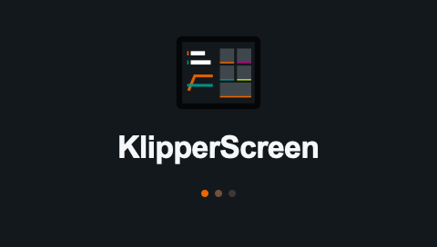
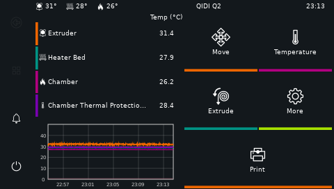
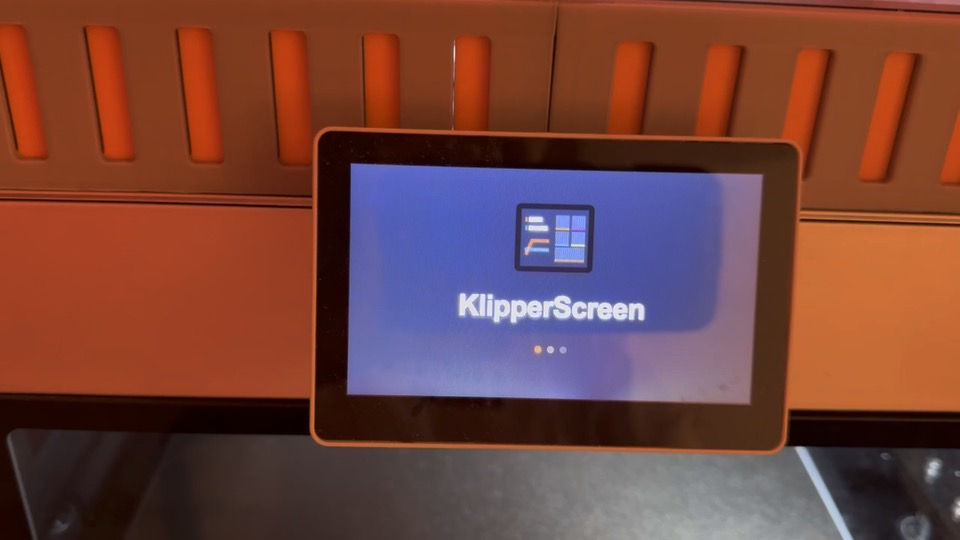
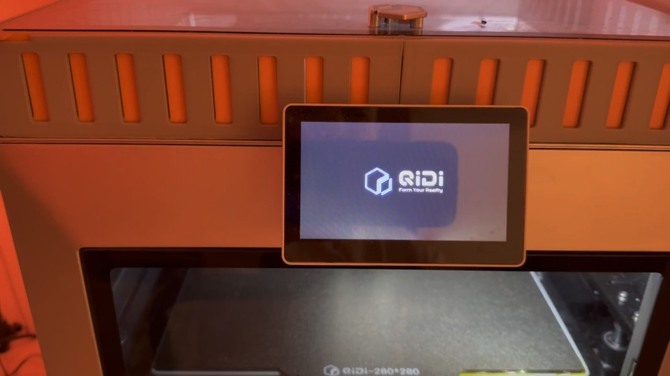

https://github.com/user-attachments/assets/28980aa5-b12a-4b6f-87f2-05b89f413b6e


https://github.com/user-attachments/assets/62a5223e-957d-4693-8391-08c91164f8c1


https://github.com/user-attachments/assets/68e310dd-f4af-480b-9329-ef28cf4354cf

<p align="center">
  
</p>

<h1 align="center">KlipperScreen on QIDI Q2</h1>

<p align="center">
  A proper interface on the stock display. No Raspberry Pi, second screen,
  or ceremonial Android tablet required.
</p>

<p align="center">
  
  
  
  
  
</p>

> [!WARNING]
> This is an unofficial project tested on a **QIDI Q2 running firmware
> `01.01.02.03`**. The installer deliberately refuses unknown firmware and
> active prints. A printer is a poor place for a confident “probably fine.”

## How did we get here?

The QIDI Q2 is a genuinely good printer: fast, enclosed, Klipper-powered, and
equipped with a perfectly decent stock display. It has almost everything.

Except KlipperScreen.

I did the responsible thing and searched for an existing solution. I found
guides for the Q1 Pro, Plus4, Raspberry Pi, old phones, and possibly a smart
fridge. For the Q2, the internet offered a tasteful silence.

That is how I became much more familiar with `rockchipdrmfb`, Goodix, Xvfb, and
the missing `/dev/tty0` than I had planned. The result is this repository: one
self-contained script, executed **on the printer itself**, that turns the stock
480×272 panel into a normal KlipperScreen.

## What works

- KlipperScreen runs directly on the stock Q2 display.
- Touch is calibrated, so buttons are pressed where the buttons actually are.
- The camera panel works through the installed `libmpv` runtime.
- A proper splash covers the black gap while GTK wakes up.
- The stock QIDI interface is kept intact.
- Swipe up from the bottom edge to open KlipperScreen.
- Swipe down from the top edge to return to the QIDI interface.
- A failed KlipperScreen startup automatically restores the stock UI.
- One script installs the whole stack and makes it survive a reboot.

<p align="center">
  
</p>

## Videos

### Full KlipperScreen tour

[](docs/media/klipperscreen-ui-tour.mp4)

Startup splash, touch navigation, panels, and the camera view—all on the stock
Q2 display. [Watch the 1:12 MP4](docs/media/klipperscreen-ui-tour.mp4).

### Returning to the stock QIDI UI

[](docs/media/stock-ui-return.mp4)

The other half of the escape hatch.
[Watch the 16-second MP4](docs/media/stock-ui-return.mp4).

Both demos are silent, fast-start H.264 at 1280×720. The originals were 1080p
HEVC phone footage; excellent for a camera roll, less excellent for browsers
and Git history.

## Quick start

Copy the installer and its checksum to the printer:

```sh
scp \
  install-klipperscreen-q2-on-printer.sh \
  install-klipperscreen-q2-on-printer.sh.sha256 \
  mks@PRINTER_IP:/home/qidi/

ssh mks@PRINTER_IP
```

Everything below runs **on the QIDI Q2**:

```sh
cd /home/qidi
sha256sum -c install-klipperscreen-q2-on-printer.sh.sha256
sudo bash install-klipperscreen-q2-on-printer.sh install
```

If you copied only the installer, you may run it directly. The script still
verifies every downloaded and embedded component before installing it.

The installer will:

1. verify the model, firmware, architecture, framebuffer, and print state;
2. create an initial on-printer backup;
3. install a pinned KlipperScreen revision and its runtime dependencies;
4. install the framebuffer bridge, touch calibration, splash, and gestures;
5. probe the display stack on a separate X display;
6. enable KlipperScreen while keeping an emergency route back to QIDI.

The first launch takes a few seconds. The logo is not merely decorative: it
means the printer is alive and GTK is gathering its thoughts.

## Display controls

| Action | Result |
|---|---|
| Swipe from the bottom edge to the top | Open KlipperScreen |
| Swipe from the top edge to the bottom | Return to the QIDI UI |
| `sudo q2-display-mode klipperscreen` | Switch to KlipperScreen now |
| `sudo q2-display-mode qidi` | Switch to QIDI now |
| `sudo q2-display-mode enable-klipperscreen` | Boot into KlipperScreen |
| `sudo q2-display-mode enable-qidi` | Boot into the stock UI |
| `sudo q2-display-mode status` | Show the active and boot UIs |

Gestures run in a separate service and do not depend on whichever UI happens to
be visible. A casual short swipe does not count: the stroke must begin at an
edge, cross most of the panel, and remain mostly vertical.

## Installer commands

```sh
# Install and make KlipperScreen the boot UI
sudo bash install-klipperscreen-q2-on-printer.sh install

# Install everything but keep QIDI as the boot UI
sudo bash install-klipperscreen-q2-on-printer.sh install --no-enable

# Show status
sudo bash install-klipperscreen-q2-on-printer.sh status

# Restore the stock UI now and on future boots
sudo bash install-klipperscreen-q2-on-printer.sh stock

# Enable KlipperScreen again now and on future boots
sudo bash install-klipperscreen-q2-on-printer.sh klipperscreen
```

`--force` exists for development on unverified firmware. If you think you need
it, what you almost certainly need first is a backup.

## Language

KlipperScreen defaults to English. The stock QIDI client does not expose a
stable language preference file on the verified firmware, and reverse
engineering proprietary runtime state just to guess a locale felt like the
wrong kind of clever. The language can be changed normally from KlipperScreen
settings after installation.

## Why is there a framebuffer bridge?

Regular KlipperScreen expects a regular Linux display stack. The Q2 kernel
provides DRM and `/dev/fb0`, but no virtual terminals such as `/dev/tty0` or
`/dev/tty1`. Debian Xorg therefore exits in `xf86OpenConsole`.

The route from GTK to pixels looks like this:

```text
KlipperScreen
    ↓
Xvfb :0, 480×272
    ↓
q2-x11-fb-bridge
    ├── frames → /dev/fb0
    └── Goodix touch → XTEST → KlipperScreen

Goodix touch → q2-display-gesture → q2-display-mode
```

The bridge is written in C, built for ARM64, and embedded in the installer
alongside its source and checksum. Until GTK paints a meaningful frame, the
bridge displays the splash. No magic is involved—just enough engineering to
look suspiciously like magic from a safe distance.

Read the full [architecture notes](docs/ARCHITECTURE.md).

## Compatibility

| Component | Verified configuration |
|---|---|
| Printer | QIDI Q2 |
| Firmware | `qd-q2-system 01.01.02.03` |
| OS | Debian 11 Bullseye |
| Architecture | ARM64, Rockchip RK3308B-S |
| Display | `rockchipdrmfb`, 480×272, 32 bpp |
| Touch | Goodix Capacitive TouchScreen, `/dev/input/event0` |
| KlipperScreen | commit `ed40799f92f8a5044082aee75b832a9e97084c7f` |

Other firmware versions are unverified, even when the number differs by one
apparently harmless digit. Vendors are remarkably good at hiding adventures
inside harmless digits.

## If something goes sideways

The shortest route home:

```sh
sudo bash /home/qidi/install-klipperscreen-q2-on-printer.sh stock
```

Or use the installed helper directly:

```sh
sudo q2-display-mode enable-qidi
```

The stock QIDI Client is never deleted. `KlipperScreen.service` is also wired to
`q2-display-fallback.service`; if the new display stack fails, the system tries
to restore the original UI automatically.

Useful logs:

```sh
sudo journalctl -u KlipperScreen.service -b
tail -f /home/qidi/printer_data/logs/KlipperScreen.log
sudo journalctl -u q2-display-gesture.service -b
```

See [troubleshooting and recovery](docs/TROUBLESHOOTING.md) for more.

## Repository map

| Path | Purpose |
|---|---|
| `install-klipperscreen-q2-on-printer.sh` | The self-contained installer and main character |
| `bridge/` | X11 → framebuffer and touch → XTEST |
| `gesture/` | Independent full-screen swipe recognizer |
| `bin/` | Display stack launcher and manual UI switching |
| `systemd/` | Main service, fallback, and gesture daemon |
| `config/` | KlipperScreen config and measured Goodix calibration |
| `assets/` | Splash source, preview, and framebuffer-ready pixels |
| `docs/media/` | Browser-friendly demo videos |
| `tools/` | Physical display test and touch calibration helpers |

## Development

```sh
make check
```

The check validates shell syntax, the installer checksum, embedded payloads,
and C sources. Building the bridge on Debian requires X11 development headers;
CI installs them automatically.

Before experimenting with the display stack, read
[CONTRIBUTING.md](CONTRIBUTING.md)—especially the part about why testing it
during a print is a creative but poor decision.

## Credits

- [KlipperScreen](https://github.com/KlipperScreen/KlipperScreen), for the
  interface that started this whole detour;
- [Klipper](https://github.com/Klipper3d/klipper) and
  [Moonraker](https://github.com/Arksine/moonraker), for the ecosystem;
- people who publish source code and logs instead of saying “works for me.”

This project is not affiliated with QIDI Tech and is not an official
KlipperScreen product. The splash icon is based on a KlipperScreen asset.

## License

[GNU AGPL v3.0 or later](LICENSE). Fork it, improve it, and please include the
printer model in bug reports. Telepathy is not currently listed as a
dependency.
